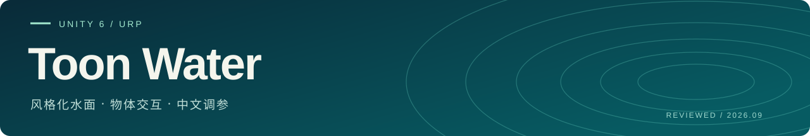
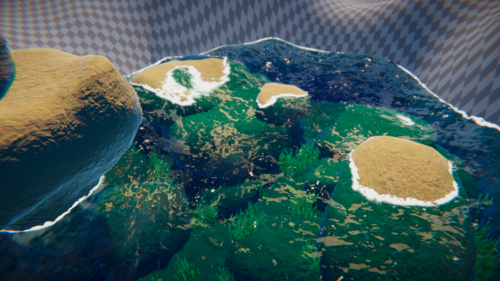
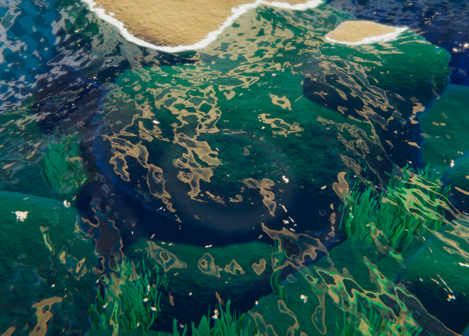
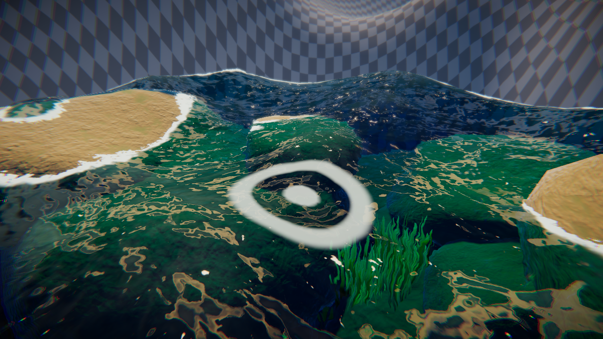

<p align="center">
  
</p>

<p align="center">
  从水面光影，到物体入水的一圈波纹。<br>
  <strong>Gerstner 波浪 · SSR / 探针反射 · GPU 涟漪 · 13 组中文调参</strong>
</p>

<p align="center">
  <a href="docs/usage.md">开始使用</a> ·
  <a href="docs/parameters.md">参数参考</a> ·
  <a href="docs/technical-design.md">技术实现</a> ·
  <a href="docs/usage.md#常见问题">问题排查</a> ·
  <a href="docs/roadmap.md">更新方向</a>
</p>



<p align="center"><sub>01 / 当前水面 · 2026-09-24 实拍 · 保留当前材质参数</sub></p>

面向 Unity 6 URP 的风格化水体，组合波浪、折射、焦散、泡沫与交互。当前代码基线为 **Reviewed 2026-09-23**，文档和截图更新于 **2026-09-24**。随包提供当前水材质使用的法线、焦散和泡沫噪声三张贴图；环境模型、环境贴图、预制材质与演示场景不包含在组件包内。

> [!IMPORTANT]
> 主 Shader：`Custom/ToonWater_Interaction_Reviewed`。请完整导入 Shader、HLSL、Runtime 与 Editor 文件。新版不再依赖旧版 `WaterRippleSimulator` / `WaterRippleEmitter`；只复制主 Shader 无法获得完整反射与交互功能。

## 从这里开始

<table>
  <tr>
    <td width="33%" valign="top"><strong>01 · 搭建水面</strong><br><br>准备贴图、配置 URP 与材质，先得到稳定的水面画面。<br><br><a href="docs/usage.md#快速搭建水面">阅读安装步骤 →</a></td>
    <td width="33%" valign="top"><strong>02 · 接入交互</strong><br><br>绑定模拟器与物体，分别控制入水圈和移动尾波。<br><br><a href="docs/usage.md#让物体与水交互">接入物体涟漪 →</a></td>
    <td width="33%" valign="top"><strong>03 · 调整风格</strong><br><br>按视觉效果调参，再用诊断视图定位反射、法线和边缘问题。<br><br><a href="docs/usage.md#按顺序调出效果">查看调参顺序 →</a></td>
  </tr>
</table>

<details>
<summary><strong>按问题查找文档</strong></summary>

| 你要做什么 | 阅读位置 |
|---|---|
| 从零搭建水面 | [安装与快速开始](docs/usage.md#准备与导入) |
| 搞清楚每组参数先调谁 | [调参顺序](docs/usage.md#按顺序调出效果) |
| 让物品入水、移动产生波纹 | [交互接入](docs/usage.md#让物体与水交互) |
| 调大涟漪、控制触发频率 | [涟漪大小与规则](docs/usage.md#涟漪大小与触发规则) |
| 查默认值、隐藏字段和单位 | [89 项 Shader 属性及组件参数](docs/parameters.md) |
| 排查透明边缘、接缝、反射或 Debug | [常见问题](docs/usage.md#常见问题) |
| 修改代码、评估成本 | [技术文档](docs/technical-design.md) |

</details>

## 特性总览

| 模块 | 当前实现 | 使用边界 |
|---|---|---|
| Gerstner 波浪 | 三层解析位移、导数法线、距离细分 | 主要用于水平水面，未自动扩大剔除 bounds |
| 表面法线 | 双层独立速度、方向校正、RNM 混合 | 提供非无缝贴图接缝补偿，有额外采样成本 |
| SSR / 探针 | 视空间追踪、交点精化、置信度混合、真实 HDR Mipmap | 屏幕外和遮挡处回退探针；依赖 Renderer Feature |
| 水色 / 折射 | 深浅染色、水底保留、RGB 色散 | 染色强度与整体可见度分离；屏幕空间近似 |
| 透明交界 | 带符号深度保护、接触柔化 | 配合项目抗锯齿，仍需动态和远景验收 |
| 岸边 / 浪尖泡沫 | 深度带、噪声消融、推拉与导数过滤 | 深度梯度只作诊断，未驱动定向泡沫 |
| 光照 | 焦散、直接 GGX 高光、碎斑、近似透光、边缘泛光 | 保留美术增益，不是完整物理水材质 |
| 交互涟漪 | 高度 / 速度 RT、固定步长传播、接触事件与尾波 | 不提供浮力、障碍物绕流或网络同步 |
| 调参 / 调试 | 13 组中文面板、预设、14 个诊断视图 | 普通视图加诊断共 15 个选项；脚本切换需同步关键词 |

## 兼容性与依赖

| 条件 | 状态 |
|---|---|
| 已验证组合 | Unity **6000.4.3f1** / URP **17.4** / Windows **D3D12** / **Forward+** |
| 必需图形能力 | Shader Model 4.6 与曲面细分；涟漪需要 RGFloat RenderTexture |
| 渲染输入 | 深度、颜色输入，启用 RenderGraph，添加 `WaterReviewColorFeature` |
| 其他平台 | 移动端、WebGL、XR、其他图形 API 等尚未完整验收 |
| 构建验证 | 现有证据来自开发工程；干净工程与目标 Player 需要再验证 |

## 文件结构

以下是新版组件与文档的配套目录，保留 `Reviewed` 名称以匹配代码、材质与 Inspector。

<details>
<summary><strong>展开完整文件结构</strong></summary>

```text
Unity6_WaterShader/
├── README.md
├── Shader/
│   ├── ToonWater_Interaction_Reviewed.shader
│   ├── ToonWaterReviewed.hlsl
│   └── WaterRippleWave.shader
├── Runtime/
│   ├── WaterReviewColorFeature.cs
│   ├── WaterRippleSimulation.cs
│   └── WaterRippleInteractor.cs
├── Editor/
│   ├── ToonWaterReviewedGUI.cs
│   └── WaterReviewDebugDrawer.cs
├── Textures/
│   ├── Water_Normal.tga
│   ├── T_Caustics06.png
│   └── FoamNoise_Linear.png
└── docs/
    ├── usage.md
    ├── parameters.md
    ├── technical-design.md
    ├── roadmap.md
    └── images/
```

</details>

## 快速开始

1. 将 `Shader/`、`Runtime/`、`Editor/`、`Textures/` 及配套 `.meta` 一起放入项目的 `Assets/ToonWater/`，等待编译完成。
2. 确认项目使用上表验证过的 URP 配置，在 URP Asset 开启 **Depth Texture** 和 **Opaque Texture**。
3. 给相机实际使用的 Renderer Data 添加 **Water Review Color Feature**；先保持提前绘制透明层为 Nothing。
4. 创建材质，选 **Custom/ToonWater_Interaction_Reviewed**，赋给水平网格；将材质绑定到 Feature 的 `Water Material`。
5. 指定所需贴图，关闭“旧吃水线”，整体可见度设 1、Debug 设 None。需要倒影时提高默认值为 0 的总反射强度，并开启 SSR。
6. 添加 **Water Ripple Simulation**，绑定水 Renderer、材质槽和 **WaterRippleWave.shader**；进入 Play 点击 12 秒涟漪测试。
7. 给交互物体添加 **Water Ripple Interactor**，绑定模拟器及 Collider，移动物体穿过水面。

完整接线、相机限制和验证步骤见[使用手册](docs/usage.md)。初次验证可采用 4× MSAA + SMAA High，再按目标 GPU 成本调整。

## 所需贴图

当前随包贴图来自开发工程水材质的实际引用，保留原始内容、GUID 与导入设置：

| 材质属性 | 随包文件 |
|---|---|
| `_NormalMap` | `Textures/Water_Normal.tga` |
| `_CausticsTex` | `Textures/T_Caustics06.png` |
| `_FoamNoiseTex` | `Textures/FoamNoise_Linear.png` |

法线文件仅缩短文件名；无需修改 Shader。导入已有开发工程时请复用原资源，避免复制相同 GUID。贴图具体导入建议见使用手册。

| 输入 | 准备方式 | 作用 |
|---|---|---|
| 法线 | Normal map、Repeat、Mipmap，优先无缝素材 | 细波纹与折射 / 反射扰动 |
| 焦散 | 可平铺光斑图；强度数据采用线性导入 | 水底动态亮纹；缺省黑时不显示 |
| 泡沫噪声 | R 通道、Repeat、Mipmap，关闭 sRGB | 泡沫、消融和碎斑形态 |
| 涟漪状态 | 运行时自动创建 RGFloat RT，无需手填 | R 高度 / G 速度 |

没有某张美术贴图时可关闭对应效果；并非三张图缺一就无法渲染。接缝补偿只改变采样，不会将原图文件变成无缝素材。

## 参数模块

推荐按 **水色 → 几何波浪 → 法线 → 折射 → 泡沫 → 反射 → 光照 → 涟漪** 调整，避免一次打开全部高亮效果后难以分辨来源。

<details>
<summary>展开常用参数速查</summary>

| 目的 | 对应参数 |
|---|---|
| 整体水面淡出 | `_WaterOpacity` |
| 调整水底染色 | `_WaterAlpha`、深浅颜色、水底保留 |
| 改大浪轮廓 | `_WaveA/B/C`、细分距离 |
| 减少移动方形接缝 | `_NormalSeamBlend`，优先检查源图 |
| 柔化物体与水交界 | `_ContactSoftness`，默认 0.08 视线深度米 |
| 控制倒影 | `_SSREnabled`、`_SSRIntensity`、`_ProbeIntensity`、`_SSRRoughness` |
| 初始入水圈变大 | Interactor 的 `radius`，不是材质法线强度 |
| 波纹更明显 | `_RippleNormalStrength`、`_RippleCrestStrength` |
| 尾波更稀疏 | `minInterval`、`wakeSpacing`、`minWakeSpeed` |

</details>

[查看分组调参说明](docs/usage.md#按顺序调出效果) · [查看所有属性与声明默认值](docs/parameters.md)

## 交互效果与限制

### 实际使用 · 亮边 0.02

<p align="center">
  
</p>

<p align="center"><sub>02 / 涟漪实际效果 · 波峰亮边 0.02 · 作者选图</sub></p>

低亮边主要保留法线、折射和倒影扰动，让涟漪融入水面。上图为作者提供的实际效果截图，保留原始画面。

<details>
<summary><strong>查看高强度诊断预览，区分测试圈与实际交互</strong></summary>



*高强度可见性预览：半径 1.8 米、力度 6 的固定测试圈。亮边可降低或关闭，实际物体使用各自的半径与力度。*

该图是此前的诊断截图，材质参数与当前实拍不同，不作为相同条件下的前后对比。

</details>

物体接触、中心穿越、离开接触带都可能产生脉冲；贴水移动满足速度、间隔和距离门槛后产生尾波。一次完整入水可能有多个脉冲，当前没有“一次性 / 持续 / 冲击力阈值”模式选择。静止物体可能被大波浪重新触发接触。

## Debug 与问题排查

先确认“正常渲染 / None”和整体可见度；排查时推荐 **4 法线 → 11 涟漪高度 → 12 涟漪梯度 → 2 探针 → 13 SSR 置信度**。模式列表与脚本切换示例见[调试模式](docs/usage.md#调试模式)。

- **有锯齿：** 分清物体轮廓白边、消融缺口和高频闪烁，分别检查柔化 / 深度、消融噪声和抗锯齿。
- **没涟漪：** 先检查 Play 与模拟器“已就绪”，再点固定预览，最后检查真实物体绑定。
- **没倒影：** 总反射强度默认 0；检查 Feature、深度、关键词和探针。
- **CPU 间歇尖峰：** 在 Profiler 定位线程和调用层级，不能仅凭画面断定由水体造成。

## 后续更新方向

> [!NOTE]
> 以下为计划方向，尚未完成，暂不承诺发布日期。当前可用功能以使用手册为准。

| 顺序 | 方向 | 目标 |
|---|---|---|
| **01** | **吃水线** | 统一波浪高度与交界判断，改善相机半入水和物体穿水时的连续性 |
| **02** | **水下效果** | 深度吸收、雾化、水下色调与上下水切换，让水面上下的表现衔接 |
| **03** | **浮力** | 基于水面高度和法线的多点浮力、阻尼与水阻，使物体随波漂浮 |
| **04** | **粒子特效** | 入水水花、出水滴落、移动尾迹与气泡，与同一交互事件联动 |

[查看实施范围、依赖与验收目标 →](docs/roadmap.md)

## 技术与已知边界

实现公式、帧内顺序、资源生命周期、成本和未完成审查项见[技术文档](docs/technical-design.md)。现有局限包括位移 bounds 未自动扩展、旧水下高度链未统一、浪尖阈值算法待重构，以及屏幕空间反射与透明排序的固有限制。

水体表现思路受 **AKUMA-Zhang** 的风格化水体启发；Gerstner 与 GGX 等基础方法沿用原项目的学习脉络。感谢原项目作者与相关图形学资料。

---

<p align="center"><sub>Unity 6 · URP · Reviewed Water</sub><br><a href="docs/usage.md">使用手册</a> · <a href="docs/technical-design.md">实现原理</a> · <a href="docs/roadmap.md">后续更新</a></p>
