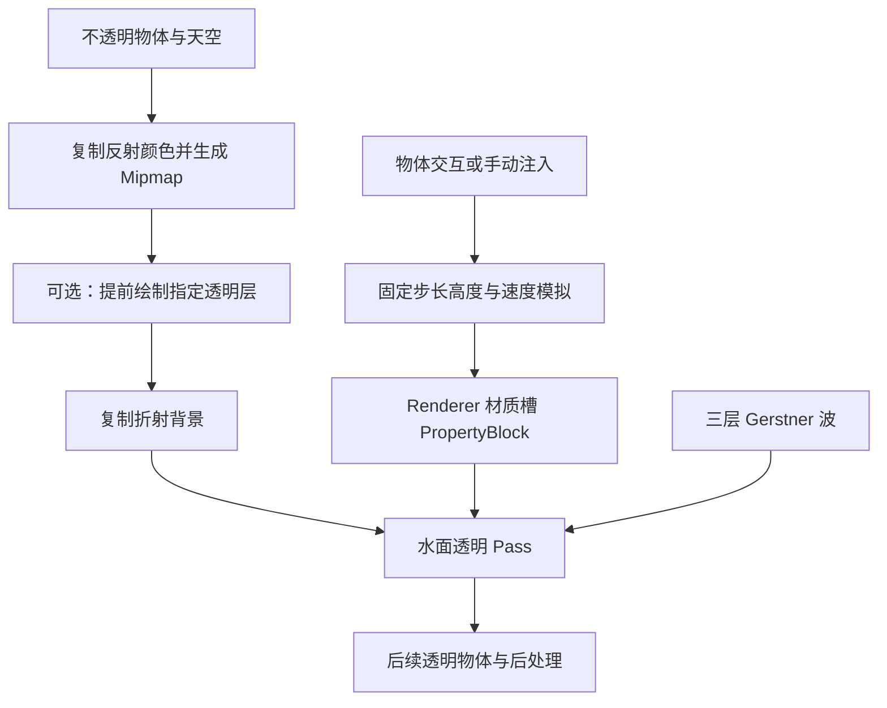

[← 首页](../README.md) · [使用手册](usage.md) · [参数参考](parameters.md) · [技术文档](technical-design.md) · [后续更新](roadmap.md)

# Unity 6 URP 水体技术文档

> **代码基线：Reviewed · 2026-09-23｜文档整理：2026-09-24**
> 对应本仓库的 Reviewed 配套实现。Shader、Runtime 和 Editor 共同组成水体系统。

项目由对游戏水体渲染的学习与实践发展而来，表现思路受 AKUMA-Zhang 启发。本篇沿用原复盘按渲染阶段讲解的方式，补齐工程接口、交互机制、性能边界与验证记录。原学习文章已备份，旧公式和旧实现不再作为新版行为说明。

[使用手册](usage.md) · [完整参数参考](parameters.md)

## 目录

- [版本与范围](#版本与范围)
- [模块与数据流](#模块与数据流)
- [几何波浪与细分](#几何波浪与细分)
- [双层法线与接缝修补](#双层法线与接缝修补)
- [透明交界与岸线泡沫](#透明交界与岸线泡沫)
- [折射水色与光照](#折射水色与光照)
- [SSR 与背景捕获](#ssr-与背景捕获)
- [涟漪传播与交互](#涟漪传播与交互)
- [面板与调试](#面板与调试)
- [性能与资源生命周期](#性能与资源生命周期)
- [验证与未解决项](#验证与未解决项)

## 版本与范围

当前主 Shader 为 `Custom/ToonWater_Interaction_Reviewed`，主要面向水平、有限范围水面。它组合解析波浪、二维高度场和屏幕空间近似，不提供完整流体动力学或浮力。


| 项目         | 当前状态                                                                |
| ------------ | ----------------------------------------------------------------------- |
| 已验证环境   | Unity 6000.4.3f1、URP 17.4、Windows D3D12、Forward+                     |
| 表面渲染     | Shader Model 4.6，Hull / Domain 细分；透明队列 3100，双面，关闭深度写入 |
| 反射资源     | RenderGraph Renderer Feature；真实 HDR Mipmap                           |
| 交互         | Play Mode 下 RGFloat 高度 / 速度场，接触事件和移动尾波                  |
| 面板         | 13 组中文参数、显式预设、0–14 调试选项                                 |
| 尚未完整验收 | 移动端、WebGL、XR、其他图形 API、相机堆叠、正交相机、独立 Player 构建   |

“Unity 6”不等于所有平台兼容。硬件细分、URP 接口及浮点 RT 支持需要在目标设备确认。

## 模块与数据流


| 文件                                    | 责任                                           |
| --------------------------------------- | ---------------------------------------------- |
| `ToonWater_Interaction_Reviewed.shader` | Properties、Pass、渲染状态与本地关键词         |
| `ToonWaterReviewed.hlsl`                | 位移、法线、SSR、折射、光照、泡沫、调试        |
| `WaterReviewColorFeature.cs`            | 准备反射 Mipmap、可选透明背景、折射背景        |
| `WaterRippleSimulation.cs`              | 高度场生命周期、世界范围、脉冲队列、材质块绑定 |
| `WaterRippleWave.shader`                | 二维波动传播和衰减                             |
| `WaterRippleInteractor.cs`              | 接触、穿越、离开及尾波检测                     |
| `Editor/ToonWaterReviewedGUI.cs`        | 中文面板、涟漪测试按钮与状态                   |
| `Editor/WaterReviewDebugDrawer.cs`      | 调试值与`_WATER_DEBUG` 关键词同步              |



反射颜色与深度来自不透明阶段。指定透明层只进入折射背景，不因此成为 SSR 可命中的几何；本方案没有通用透明排序或透明深度重建能力。

## 几何波浪与细分

### 参数与位移

每层向量 `wave=(x,z,s,λ)`：方向 `d=normalize(wave.xy)`，速度 `c=length(wave.xy)`，陡峭度 `s=clamp(wave.z,-0.95,0.95)`，波长取 `max(abs(wave.w),0.01)`。方向长度小于 `1e-5` 或波长绝对值小于 `1e-4` 时整层返回零。

```text
k = 2π / λ
a = s / k
φ = k · (dot(d, p.xz) - c · t)
Δp = (d.x · a · cosφ, a · sinφ, d.y · a · cosφ)
```

三层位移相加，再叠加涟漪高度。固定陡峭度时，增大波长也会增大波高。负陡峭度反转位移相位，不单独改变传播方向。相位逐周期取模，替代每 3600 秒重置时间；长时间浮点精度误差仍存在。

### 导数法线

只初始化一次 `T=(1,0,0)`、`B=(0,0,1)`，逐层累加位移导数：

```text
∂Δp/∂x = (-dx²·s·sinφ, dx·s·cosφ, -dx·dz·s·sinφ)
∂Δp/∂z = (-dx·dz·s·sinφ, dz·s·cosφ, -dz²·s·sinφ)
N = normalize(cross(B,T))
```

这修正旧版重复加入单位副切线造成的法线偏差。切线再相对法线正交化，供切线空间法线使用。

细分因子随相机距离衰减至 1，运行时限制 1–63，并保护近远距离相等的情况。细分增加几何密度，不提高涟漪纹理分辨率。GPU 位移不会自动扩大 CPU 剔除 bounds；当前未实装自动扩界（W11）。

## 双层法线与接缝修补

第一层使用网格 UV、贴图 Tiling / Offset 和 `_NormalSpeed.xy`；第二层旋转 UV、乘 `_NormalLayer2Scale`，使用 `_NormalSpeed.zw` 独立流动。第二层法线 XY 旋回同一方向，再用 RNM 组合。

已确认的移动方形边界来自源法线贴图上下 / 左右不连续。Repeat 只重复像素，不能修复素材断裂。`WaterTileNormal` 在边缘混合半格偏移采样：

```text
f = frac(uv)
w = smoothstep(0, blendWidth, min(f, 1-f))
采样偏移 = (0,0), (0.5,0), (0,0.5), (0.5,0.5)
权重 = wx·wy, (1-wx)·wy, wx·(1-wy), (1-wx)·(1-wy)
```

原采样在自身断裂处权重趋零；偏移采样在那里提供连续内容。先解码法线再混合、归一化，使用原 UV 的显式梯度采样，避免 `frac` 求导导致 LOD 跳变。

`_NormalSeamBlend` 默认 0.15，范围 0–0.25；0 关闭。源图像素没有修改，边界附近纹样会改变，单层最坏增加至 4 次采样。真正无缝素材建议关闭补偿。

## 透明交界与岸线泡沫

```text
signedDepth = linearSceneEyeDepth - waterSurfaceEyeDepth
contactCoverage = saturate(signedDepth / max(_ContactSoftness,0.0001))
waterDepth = max(0,signedDepth)
finalAlpha = _WaterOpacity · shoreCoverage · contactCoverage
```

深度差是视线方向的眼空间距离，不是垂直水深或沿地面的距离。前景物体处不产生水面覆盖，避免将负深度截成零后误生成浅水白沫。柔化默认 0.08 米，可从 0.03–0.12 微调；过大会出现透明边带。设置 0 关闭柔化宽度，前景保护保留。

透明是渲染条件之一，深度解析、硬裁剪、高频高光和像素覆盖均可能造成锯齿。Reviewed 示例采用 4× MSAA + SMAA High；导入 Shader 不会自动修改新项目的抗锯齿设置。

岸线消融使用 `shoreDistance=depth-(1-noise)·erosion`，通过 `fwidth` 扩宽边界过渡，并保留远离边界的剔除。泡沫由深度带、正弦推拉、噪声与浪尖遮罩组合，阈值也进行导数过滤。真实噪声缺口需要降低消融量，不能仅靠后处理消除。

正常泡沫未使用四方向深度梯度驱动流向；四次邻域深度查询只在 Debug 6 内运行（W17）。浪尖仍采用 `saturate((displacement.y/3-threshold)·strength)`，面板单位换算没有完成 W10 算法重构。涟漪亮边独立于该浪尖阈值和 `_FoamEnabled`。

## 折射水色与光照


| 模块     | 实现与限制                                                                                |
| -------- | ----------------------------------------------------------------------------------------- |
| 折射     | 法线差投影到视空间偏移背景 UV，近岸和屏幕边缘衰减，检查越界与前景深度；无法恢复屏幕外颜色 |
| 色散     | RGB 不同偏移；强度 0 时一次背景采样                                                       |
| 水色     | 深浅颜色与背景染色、水底保留、曝光组合，非光谱吸收模型                                    |
| 可见度   | `_WaterAlpha` 控制染色；`_WaterOpacity` 控制整体淡出，0 会在 Debug 前剔除                 |
| 焦散     | 水底位置双层流动纹理，深度衰减及水底阴影；非光线追踪焦散                                  |
| 直接高光 | GGX 的 D、Smith 遮蔽与 Schlick 菲涅尔；`_SpecularF0` 只影响此项                           |
| 碎斑     | 艺术化噪声阈值，导数过滤；高增益仍可闪烁                                                  |
| 透光     | 近似背光透射，响应主光阴影；非体积多次散射                                                |
| 泛光     | 掠角项，范围与反射集中度可分离                                                            |

旧 `_PBRSmoothness` 保留序列化，面板显示 `sqrt(max(2/(smoothness+2),0.02))` 对应的直接高光粗糙度。环境反射 `_SSRRoughness` 为独立控制，不能直接合并。

## SSR 与背景捕获

SSR 在视空间追踪，起点沿法线偏移，独立设置最大距离、步数、步长、厚度和精化次数。检测从场景表面前侧进入后侧后，二分缩小交点区间；屏幕边缘、距离与厚度误差限制置信度。命中颜色从 `_WaterReviewReflectionTexture` 采样真实 Mipmap。

失败区域混合 URP `GlossyEnvironmentReflection` 探针结果。新版不再按亮度替换自定义三级 Cubemap。屏幕外、遮挡背面、薄物体和深度断层仍有限制；增大厚度可能漏光，更多步数不保证得到真实倒影。

Renderer Feature 在 `BeforeRenderingTransparents` 执行：复制不透明反射并生成 Mipmap → 可选透明层 → 折射背景。反射降采样默认 2、折射默认 1。

每相机先重置有效标记；Preview、Reflection、指定 `targetTexture` 的相机，以及没有可用中间颜色目标时跳过捕获。离屏相机不能直接照搬此路径。

Feature 的 `waterMaterial` 用于判断是否跳过反射复制。单水材质可绑定；多材质需求不同时应留空以始终准备资源，或扩展需求汇总，否则一份关闭 SSR 的材质可能影响另一份开启 SSR 的水面。

提前绘制的透明层必须从 Renderer 的正常 Transparent Layer Mask 排除，且不能包含水体。它适合明确位于水面后的透明内容，不能通用解决跨水面玻璃和粒子排序。

## 涟漪传播与交互

### 高度场

两张 RGFloat RT 交替读写，R 高度（米）、G 垂直速度（米/秒）。固定步长 1/60 秒，每帧最多补 4 步，丢弃更多时间债务以避免卡顿后的补帧雪崩；代价是长卡顿时模拟时间落后。

```text
lap(h) = (hL+hR-2h)/dx² + (hD+hU-2h)/dz²
v' = (v + impulse + c²·lap(h)·dt) · exp(-(damping+12·edge²)·dt)
h' = h + v'·dt
cEffective = min(cRequested,0.9/(dt·sqrt(1/dx²+1/dz²)))
```

速度限制 ±8，波高限制 `±maxHeight`；触及高度上限时速度归零。边界阻尼与外侧两格过渡吸收波纹。未实现障碍物反射、绕流、浅水传播和浮力。

### 扰动输入

`EmitRipple(Vector3 position,float radius,float velocity)` 返回是否入队。X/Z、半径和力度必须有限，XZ 必须在水域矩形内；Y 不参与注入位置，直接调用不会检测碰水。

- 每次队列最多 32 个脉冲；满时返回 false，并增加 `DroppedImpulses`。
- 半径最小 2 个网格间距，最大较短世界边长的 1/4；力度限制 ±8。
- 压力核 `(1-q)²(1-4q)`，`q=saturate(r²/R²)`，连续圆盘积分零；离散采样和限幅仍可能产生偏差。
- 映射 `(position.xz-centerXZ)/sizeXZ+0.5`；世界中心或范围变化时清空波纹。

顶点读取高度改变 Y；片元按世界米尺度中心差分，使用 `normalize(N-(dh/dx,0,dh/dz)·N.y)` 修正法线，与网格 UV 方向无关。高度强度同时放大位移与梯度，法线增益只放大视觉扰动，波峰亮边使用泡沫颜色改善可读性。

### 物体判定

Interactor 使用 Collider 世界 AABB；没有或禁用 Collider 时，用物体位置和 `2·radius` 大小的 AABB 替代。无需 Rigidbody，不依赖触发器回调。

`contact = bounds.min.y <= surface+margin && bounds.max.y >= surface-margin`。

表面高度通过三层 Gerstner 与 4 次固定点逆映射近似查询，不读取 GPU 涟漪。陡浪下不是精确浮力接口。


| 条件                        | 行为                                         |
| --------------------------- | -------------------------------------------- |
| 首次在接触带内 / 进入接触带 | 入水脉冲                                     |
| 中心跨过水面                | 穿越脉冲；快速跨越插值定位                   |
| 离开接触带，包括完全潜入    | 半强度离开脉冲                               |
| 接触中水平移动              | 最低速度、最短间隔和空间间距同时达标才发尾波 |
| 深水中移动                  | 不持续发尾波                                 |

事件共享最短间隔。一次下沉可能产生接触、中心穿越、完全没入多个脉冲，不是严格只发一圈。静止物体也可能随大波浪改变接触状态而重触发。没有“一次 / 持续 / 力量阈值”可选模式，也没有质量或碰撞力门槛。

12 秒预览独立于物品：在主相机前找开阔位置，每 1.5 秒注入半径 1.8 米、力度 -6 的脉冲；不读取物品参数。

## 面板与调试

13 组中文面板按视觉效果组织，高级项折叠；颜色和强度相邻。旧字段保留兼容材质；重绘不迁移参数，明确选择预设才写入。浪尖阈值按米显示仅做乘 / 除 3 换算。

Debug 共 15 个选项（正常 + 14 个诊断）：1 SSR、2 探针、3 混合反射、4 世界法线、5 泡沫、6 岸线梯度、7 反射菲涅尔、8 泛光、9 泛光系数、10 命中 LOD、11 涟漪高度、12 涟漪梯度、13 命中置信度、14 步数比例。

Inspector 同步 `_WATER_DEBUG`；脚本只设 `_DebugMode` 不足以启用变体。SSR 开关同样要同步 `_WATER_SSR`。Player 动态开启前必须保留相应变体，编辑器有效不等于构建中一定存在。

## 性能与资源生命周期

主要 GPU 成本来自细分、SSR 查询、颜色复制 / Mipmap、透明覆盖、法线补偿和涟漪模拟。MSAA / SMAA 增加成本，不代表总性能提升。预设只是调参起点，没有设备帧率保证。

512² 两张 RGFloat 像素存储约 4 MiB；1024² 约 16 MiB，不含驱动开销。正常涟漪运行没有每帧 CPU 读回、全场景扫描或逐发射器临时 RT；初始化失败仅报一次错误并禁用。

每个 Renderer 只允许一个模拟器所有者，通过指定材质槽 PropertyBlock 绑定，不修改共享材质或全局涟漪纹理。禁用时清理自身绑定并释放 RT / 运行材质，保留其他材质块字段。运行中改 Renderer、材质槽或分辨率后须重新启用。

## 验证与未解决项

2026-09-23 开发场景验证：Shader 消息为空；传播数值有限、范围外输入拒绝、队列上限、资源释放重建和其他 PropertyBlock 字段保留通过。近 / 远景接触截图与数值记录已保存。512²、约 65.22 米水域、速度 3、衰减 1.2 的测试中，传播半径约为 1 秒 2.883 米、2 秒 5.699 米、5 秒 14.022 米，仅代表该组输入。


| 审查项          | 当前状态                                                     |
| --------------- | ------------------------------------------------------------ |
| W03 / W04       | 导数与双层法线修正                                           |
| W07 / W08 / W09 | 真实 Mipmap、SSR、可见度分离与透明背景实装                   |
| W14 / W16 / W17 | 光照、条件跳过、调试专属梯度查询实装                         |
| W21 / W22 / W23 | 原生探针、数值保护、线性噪声及阈值过滤实装                   |
| W10             | 浪尖只改面板单位，算法仍待重构                               |
| W11             | 位移 bounds 自动扩展未实装                                   |
| W02 / W06       | 旧高度捕获与水下链路未统一，新版独立使用应关闭旧吃水线       |
| 透明交界        | 带符号深度保护与柔化已实装，不能保证所有动态视角完全消除闪烁 |
| 法线接缝        | 已实装采样补偿，源图未修改，仍优先使用无缝素材               |
| 发布验收        | 现有证据来自开发工程，干净工程与独立构建尚需验证                   |

历史审查、数值 JSON、性能取样与截图位于开发工程 `Docs/ShaderReview/`。旧版学习稿保留在作者开发工程的备份中。
